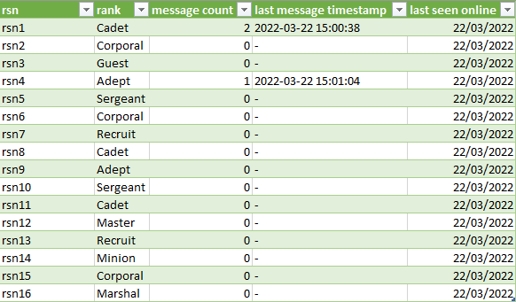

# Clan Activity Tracker
This plugin will track some stats on your clan/fc members to help you with filtering out inactive players or to reward active players.

It will track the date the player was last seen and the amount of messages since tracking started. 
 
Note that this plugin sees a player as their RSN, so if a player namechanges it will become a seperate entry.

All data is saved to a .csv file which can be found in the directory "/.runelite/clan-activity-tracker/". The name of the file will be the name of the clan/fc where spaces are replaced by underscores and the filename will end in whatever you have set as "File Suffix" in the plugin settings.

You can choose whether to track Clan or FriendsChat data by selecting the respective option from the dropdown menu in the "Chat Type" setting.

This is what the data looks like after loading it into excel, the player names are removed for privacy reasons:
